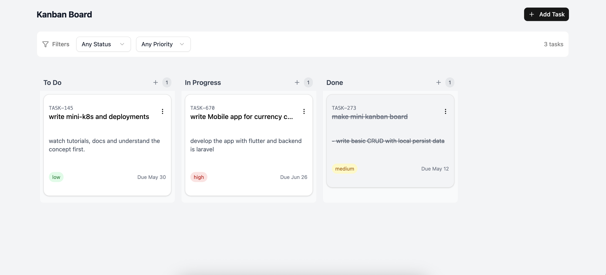

# Mini Kanban Board

A lightweight yet powerful Kanban board application for task management with drag-and-drop capabilities, filtering, and task prioritization.

**Live Demo:** [https://mini-kanban-board.vercel.app/](https://mini-kanban-board.vercel.app/)



## Tech Stack

This project is built with modern web technologies:

- **Framework**: [React 19](https://react.dev/) with [TypeScript](https://www.typescriptlang.org/)
- **Build Tool**: [Vite 6](https://vitejs.dev/)
- **Styling**: [TailwindCSS 4](https://tailwindcss.com/)
- **UI Components**: Custom components with [Radix UI](https://www.radix-ui.com/) primitives, [shadcn/ui](https://ui.shadcn.com/)
- **State Management**: [Zustand](https://zustand-demo.pmnd.rs/) with persistence
- **Drag and Drop**: [dnd-kit](https://dndkit.com/)
- **Icons**: [Lucide React](https://lucide.dev/)
- **Utilities**:
  - UUID for unique IDs
  - clsx & tailwind-merge for class management
  - class-variance-authority for component variants

## Features Implemented

- **Drag and Drop Interface**: Intuitive drag-and-drop functionality for moving tasks between columns
- **Task Management**:
  - Create, edit, and delete tasks
  - Set task priorities (Low, Medium, High)
  - Add task descriptions and due dates
  - JIRA-like task code generation
- **Column Organization**:
  - Standard workflow columns (Backlog (currently comment out), Todo, In Progress, Done)
  - Visual indicators for task status
- **Filtering**:
  - Filter tasks by status
  - Filter tasks by priority level
  - Clear filters functionality
- **Persistence**: Task data is saved to local storage
- **Responsive Design**: Works on desktop and mobile devices
- **Accessibility**: Built with accessible UI components

## Assumptions Made

- **Single User Focus**: The application is designed for individual use rather than team collaboration
- **Local Storage**: All data is stored locally in the browser with no backend server
- **Task Structure**: Tasks include essential fields like title, description, status, priority, and dates
- **Workflow**: Standard Kanban workflow with three columns (Todo, In Progress, Done)
- **Modern Browser Support**: Targets modern browsers with ES6+ support

## Running the Project

### Prerequisites

- Node.js (v18 or higher)
- npm or yarn or pnpm

### Installation

1. Clone the repository:

   ```bash
   git clone https://github.com/yourusername/mini-kanban-board.git
   cd mini-kanban-board
   ```

2. Install dependencies:

   ```bash
   npm install
   # or
   yarn
   # or
   pnpm install
   ```

3. Start the development server:

   ```bash
   npm run dev
   # or
   yarn dev
   # or
   pnpm dev
   ```

4. Open [http://localhost:5173](http://localhost:5173) in your browser.

### Build for Production

```bash
npm run build
# or
yarn build
# or
pnpm build
```

### Preview Production Build

```bash
npm run preview
# or
yarn preview
# or
pnpm preview
```

## License

```

```
